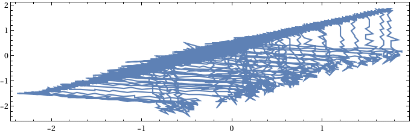

## Delay estimator to reconstruct states trajectory of a black box dynamical system
#### Estimation of Time Delay for reconstructing the state-space of attractor can be done based on the following options: 
* favourable value of the time delay is where autocorrelation is about zero.
* favourable value of the time delay is one quarter of the dominant period.
```mathematica
Clear["Global`*"];
ClearSystemCache[];
SetDirectory[NotebookDirectory[]];
cm = 72/2.54 ;(*centimetres*)
st = 2*^-3*10/5000.;(*oscope sample time*)
asr = 0.3;(**aspect Ratio**)
SetOptions[ListLinePlot, PlotRange -> All, AspectRatio -> asr, ImageSize -> 18 cm, Axes -> False, Frame -> True, FrameStyle -> Directive[Thickness[0.0015], FontFamily -> "Times New Roman", FontSize -> 10, Black]];
SetOptions[ListPlot, PlotStyle -> {Black, PointSize[Medium]}, PlotRange -> All, AspectRatio -> asr, ImageSize -> 18 cm, Axes -> False, Frame -> True, FrameStyle -> Directive[Thickness[0.0015], FontFamily -> "Times New Roman", FontSize -> 10, Black]];
SetOptions[Plot, PlotRange -> All, AspectRatio -> asr, ImageSize -> 18 cm, Axes -> False, Frame -> True, FrameStyle -> Directive[Thickness[0.0015], FontFamily -> "Times New Roman", FontSize -> 10, Black]]; 
 (********************* Switiching frequency******************************)
Fc = 2000; 
 (********************* Refrence frequency******************************)
Fref = 50;
```

```mathematica
(*************************Chaotic Sine PWM******************************)
 (*Chaotic PWM Carrier*)
  vatcb = Import["ALL0001-MCBI.CSV"][[19 ;; 5018, 8]]; 
   tt = Table[st i, {i, 0, 5018 - 19}]; 
   ListLinePlot[Transpose[{tt, vatcb}]]
```


```mathematica
(******
Estimation of Time Delay for reconstructing the state-space of attractor can be done based on two methods: 
1-favourable value of the time delay is where autocorrelation is about zero
2-favourable value of the time delay is one quarter of the dominant period
******)
  lcr = CorrelationFunction[vatcb, {2000}]; 
   ler = Table[0.01, Length@lcr]; 
   \[Tau]d1 = First@First@Position[MapThread[LessEqual, {Abs@lcr, ler}], True] 
   \[Tau]d2 = Floor[1/(4 Fc)/st] 
   \[Tau]d = \[Tau]d2;

(*1078*)

(*31*)
```

```mathematica
(*****Fluctuation of the autocorrelation shows that the signal is not periodic against chaotic signals that have decaying autocorrelation plot*****)
  ListPlot[lcr, PlotStyle -> {Black, PointSize[Small]}]
```


```mathematica

  pts2D = Table[{vatcb[[i]], vatcb[[i + \[Tau]d]]}, {i, 5000 - \[Tau]d}]; 
   ListLinePlot[pts2D]
```



```mathematica

  Graphics[{Brown, Line[pts2D], Red, Point[pts2D]}] /. Line[rest_] :> {Arrowheads[Table[0.02, {i, 0, 1, .02}]], Arrow[Line@rest]}
```


```mathematica
pts3D = Table[{vatcb[[i]], vatcb[[i + \[Tau]d]], vatcb[[i + 2 \[Tau]d]]}, {i, 5000 - 2 \[Tau]d}];
Graphics3D[{Brown, Line[pts3D], Red, Point[pts3D]}] /. Line[rest_] :> {Arrowheads[Table[0.02, {i, 0, 1, .02}]], Arrow[Line@rest]}
```


```mathematica
ps = {Null, Null, Null, Null};
b = 1.09;
Do[
  Npt = 5000 - (emD - 1) \[Tau]d; 
   dState = Table[vatcb[[i + j \[Tau]d]], {i, Npt}, {j, 0, emD - 1}]; 
  (************** Parker, Chua- Practical Numerical Algorithms for Chaotic Systems page182-185 ***********) 
   rij = First@Table[EuclideanDistance[dState[[i]], dState[[j]]], {i, 1, Npt - 1}, {j,i + 1, Npt}]; 
   k0 = Length@rij; 
   rij = Cases[rij, Except[0.]]; 
   k0 = k0 - Length@rij; 
  (*MinMax@rij*) 
  (*Log[b,MinMax@rij]*) 
   eij = Log[b, rij]; 
   leij = IntegerPart[eij]; 
   ci = 0; 
   crr = Table[{i + 1, ci = Count[leij, i] + ci + k0}, {i, Min@leij, Max@leij}]; 
   logcr = Transpose[{crr[[All, 1]], Log[b, 2 crr[[All, 2]]/Npt^2]}]; 
   plot1 = ListPlot[logcr]; 
   fit = LinearModelFit[Drop[Drop[logcr, 15], -10], x, x]; 
   {min, max} = MinMax@First@Transpose@logcr; 
   plot2 = Plot[Normal[fit], {x, min, max}]; 
   ps[[emD - 1]] = Show[plot1, plot2, PlotLabel -> "corr_dim=" <> ToString@Normal[fit][[2, 1]], FrameLabel -> {"log(r)", "log[C(r)]"}] 
  , {emD, 2, 5}]
ps
```


